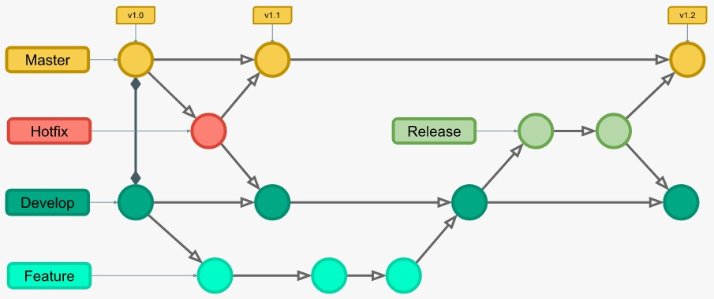
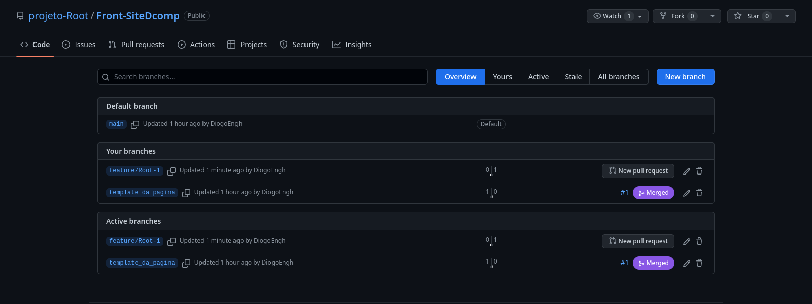
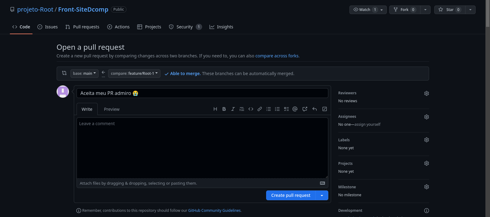
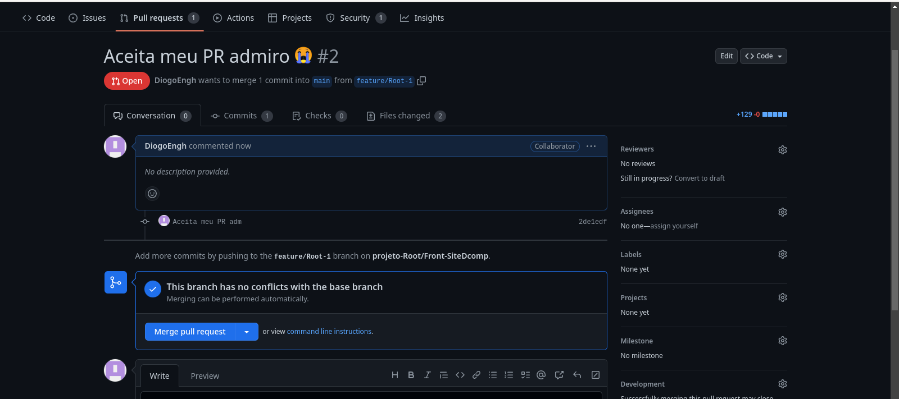

# Rotina de desenvolvimento

Neste documento encontram-se instruções para prosseguir com uma rotina de desenvolvimento para as páginas do projeto. Como estamos crescendo como um grupo, foi-se nescessário melhorias no rítmo de produção. Como profissionais, o mercado de trabalho num geral não pode haver falhas, ou devemos nos preparar para evitar elas.

`No final deste documento fica um explicativo dos termos falados aqui.`

---

## GitFlow

Sem entrar no mérito de ficar detalhando como funciona o gitflow, vamos adaptar ele ao nosso projeto. Abaixo um esquema em foto resumido de como funciona essa metodologia de desenvolvimento.



Para efeito de adaptação vamos considerar que a master da imagem é nossa branch main e que por enquando a main e a develop são a mesma coisa.

---

## Aplicação

Primeiramente, no nosso projeto, vão existir dois tipos de branchs diferentes em que vamos desenvolver as branchs de bugs `(hotfix)` e a de adição `(feature)`.

Independente de você for criar uma hotfix ou feature, existem processos que devem ser seguidos.

# 1. Atualizar repositório principal

Na nossa rotina de desenvolvimento, devemos sempre que possível antes de criar uma branch para hotfix ou feature trabalhar encima da versão mais atual do projeto.

Primeiro comando que você deve fazer é para verificar em qual branch você está trabalhando.

Inicialmente temos a branch main que é a branch principal, nós podemos chamar de branch de produção. Agora indo para a rotina de desenvolvimento. Para isso, abra o terminal na raiz do projeto e digite

```bash
$ git branch
```

Ao fazer isso vão aparecer todas a branchs locais que estão em sua máquina. A princípio como você não deve ter criado nenhuma branch, o resultado deve aparecer assim.

```bash
$ *main
```

O que significa que em sua máquina só tem a branch main.

Quando se certificar de que está na main digite o seguinte comando para puxar atualizações mais recentes para sua máquina.

```bash
$ git pull
```

# 2. Criar nova branch 

Para criar a nova branch vamos primeiro nos levar em conta se é uma feature ou hotfix, não podemos também criar uma branch com o mesmo nome de uma já existente, ou muito provavelmente vai dar muitos problemas na hora que você for subir ela pro github. Para resolver isso vamos no trello colocar um id identificador da tarefa para cada pessoa. Agora vamos as regras de nomeação. Para fins de exemplo vamos considerar que sua tarefa tem id: 1.

### Se for feature o nome seria `feature/Root-1`.

### Se for hotfix o nome seria `hotfix/Root-1`.

Aí o comando no terminal para criação da branch seria

```bash
$ git checkout -b feature/Root-1
```

O checkout serve para mudar de branch, a flag `-b` serve para criar a branch. Logo o comando vai criar uma branch e mover para ela.

Se você digitar 

```bash
$ git branch
```

Vai ter esse resultado sinalizando que você está na nova branch

```bash
$ main
$ *feature/Root-1
```

Depois é aconselhável que você restaure a sua branch para não levar possíveis commits indesejados.

```bash
$ git restore .
```
Pronto, já pode trabalhar na sua tarefa.

# 3. Depois de terminar a tarefa

### Quando você terminar sua task, vai precisar mandar ela pro github, pois esse repositório só existe em sua máquina.

Primeiro você tem que adicionar todas as modificações usando o comando

```bash
$ git add .
```

Em seguida você deve commitar seu código

```bash
$ git commit -m "Primeiro commit"
```

Logo em seguida enviar para o github

```bash
$ git push
```

Se esse é seu primeiro push, provavelmente ele não vai deixar e vai te mandar um comando para você poder realizar o push, neste exemplo o comando vai vim nesse formato

```bash
$ git push --set-upstream origin feature/Root-1
```

Pronto, sua alterações já estão no github.

# 4. Pull Request

O Pull Request é a etapa final para o desenvolvimento de uma nova feature ou hotfix. Você vai precisar entrar no seu github, no repositório do projeto, vai em `branchs`, Vai ter uma lista de branchs. Você vai procurar em suas branchs a que você acabou de enviar.



Você vai clicar em `New pull request` e vai abrir a seguinte página:



Verifique se o merge vai acontecer da sua branch para a main, neste exemplo está correto, se não estiver é só você alterar. Depois é só criar o pull request.



Quando você chegar nessa tela não vai precisar fazer mais nada, só esperar o code review e o adm faz o merge se estiver tudo ok no código.

Pronto, rotina realiazada.

# Termos citados

## Branch

Branch, traduzindo significa ramificação. Um galho, um caminho criado apartir de outra branch. Imagine isso como uma árvore.

## Commit

Commits são comentários e modificações sobre seu código.

## Merge

Merge vai juntar sua branch a outra. Basicamente isso.